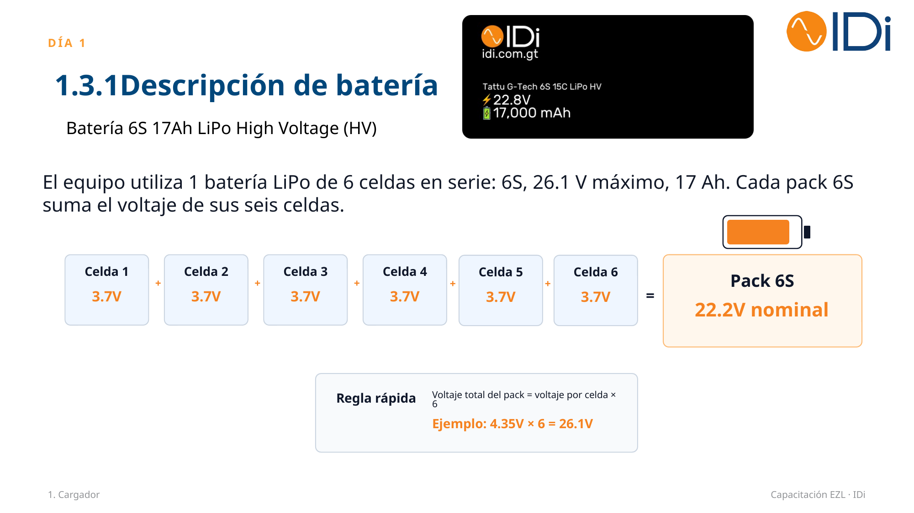
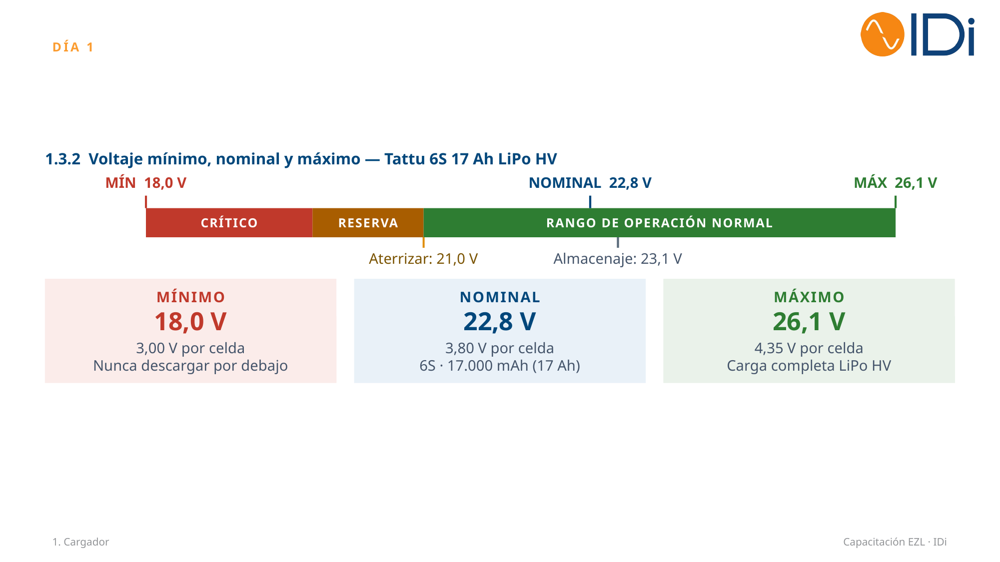
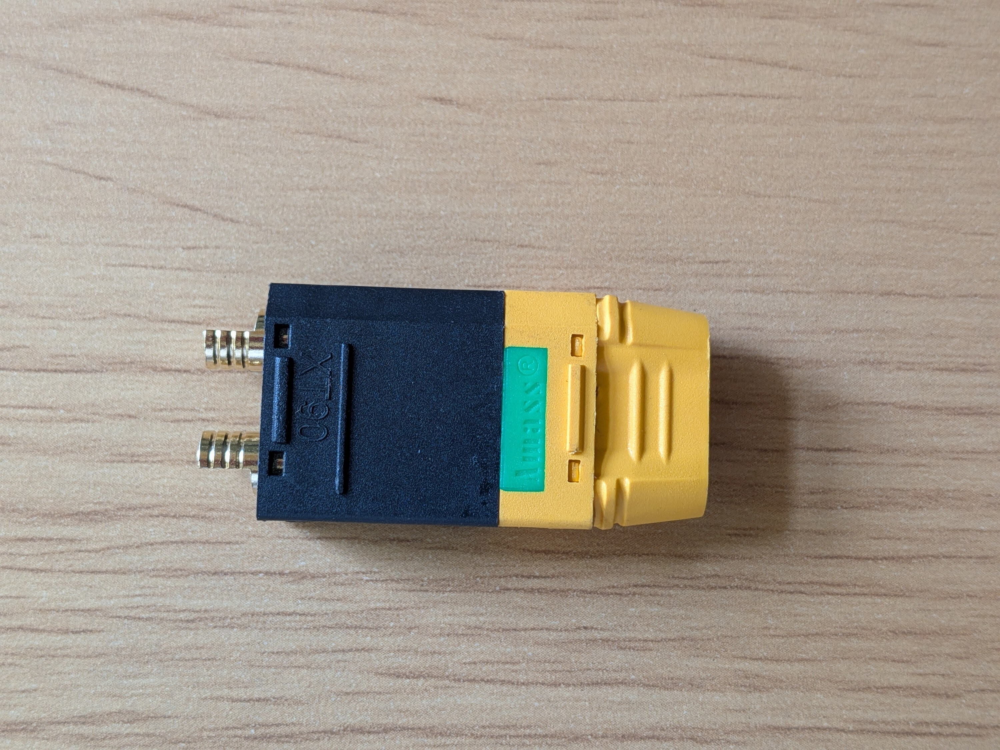
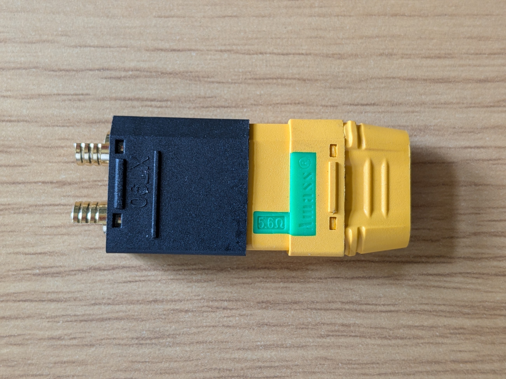

# 🔋 Baterías

El dron EZL utiliza una batería **LiPo High Voltage (HV)** de 6 celdas en serie (6S). Esta sección resume su descripción técnica, los rangos de voltaje seguros, la conexión al dron y las recomendaciones de seguridad para su manejo, carga y almacenamiento.

## 📋 Descripción de la batería

El equipo utiliza 1 batería LiPo de 6 celdas en serie: **6S, 26.1 V máximo, 17 Ah**. Cada pack 6S suma el voltaje de sus seis celdas.

| Especificación | Valor |
|---|---|
| Modelo | Tattu G-Tech 6S 15C LiPo HV |
| Configuración | 6S (6 celdas en serie) |
| Voltaje nominal | 22.8 V |
| Capacidad | 17,000 mAh (17 Ah) |

:::tip[Regla rápida]

Voltaje total del pack = voltaje por celda × 6

**Ejemplo:** 4.35 V × 6 = 26.1 V

:::

## ⚡ Voltaje mínimo, nominal y máximo

| Nivel | Voltaje total | Voltaje por celda | Notas |
|---|---|---|---|
| 🔴 Mínimo | 18,0 V | 3,00 V | Nunca descargar por debajo |
| 🔵 Nominal | 22,8 V | 3,80 V | 6S · 17.000 mAh (17 Ah) |
| 🟢 Máximo | 26,1 V | 4,35 V | Carga completa LiPo HV |

:::caution[Puntos de referencia en vuelo]

- **Aterrizar:** al llegar a 21,0 V (3,50 V por celda).
- **Almacenaje:** dejar la batería a 23,1 V (3,80–3,85 V por celda) si no se usará pronto.

:::

## 🔌 Conexión al dron

  

**✅ Conexión adecuada**

Ambos conectores asegurados correctamente.

  

  

**❌ Conexión inadecuada**

Conectores no insertados por completo.

  

## 🛡️ Seguridad de baterías

### Recomendaciones de manejo

- 👁️ **Inspección visual:** revise la batería antes y después de cada vuelo: hinchazón, golpes, cables o conectores dañados. Una batería inflada se retira de servicio.
- 🌡️ **Temperatura:** no cargue ni vuele con la batería caliente (más de 45 °C). Deje enfriar de 20 a 30 minutos después de cada vuelo.
- ⚡ **Límites de voltaje:** nunca descargue por debajo de 3,00 V por celda (18,0 V). Planifique el aterrizaje al llegar a 3,50 V por celda (21,0 V).
- 📦 **Transporte:** traslade en caja ignífuga o bolsa LiPo, con los conectores protegidos y la batería a voltaje de almacenaje (23,1 V).
- 🔌 **Conexión al dron:** conecte solo con el dron apagado y las hélices libres. Verifique la polaridad y que el conector encaje por completo.

:::danger[Nunca]

No perfore, desarme, moje ni exponga la batería al sol por largos períodos de tiempo. Nunca deje baterías cargando sin supervisión.

:::

### Carga, almacenamiento y actuación ante emergencias

- 🔋 **Carga:** cargue a 1C como máximo (17 A) en modo LiPo HV con balanceo, hasta 4,35 V por celda, sobre superficie no inflamable (cargador automático).
- 🔁 **Ciclo de vida:** lleve registro de ciclos. Retire la batería si pierde capacidad, se calienta en exceso o presenta hinchazón.
- 🗄️ **Almacenamiento:** si no se usará en más de dos días, guarde a 3,80–3,85 V por celda (22,8–23,1 V), en lugar seco y entre 15 y 25 °C.

:::danger[Emergencia: fuego]

No aplique agua sobre la batería en llamas. Use extintor clase D o arena seca y retire el material inflamable cercano.

:::

:::caution[Emergencia: daño]

Aísle la batería dañada al aire libre, en recipiente metálico, y obsérvela al menos 30 minutos antes de desecharla.

:::
