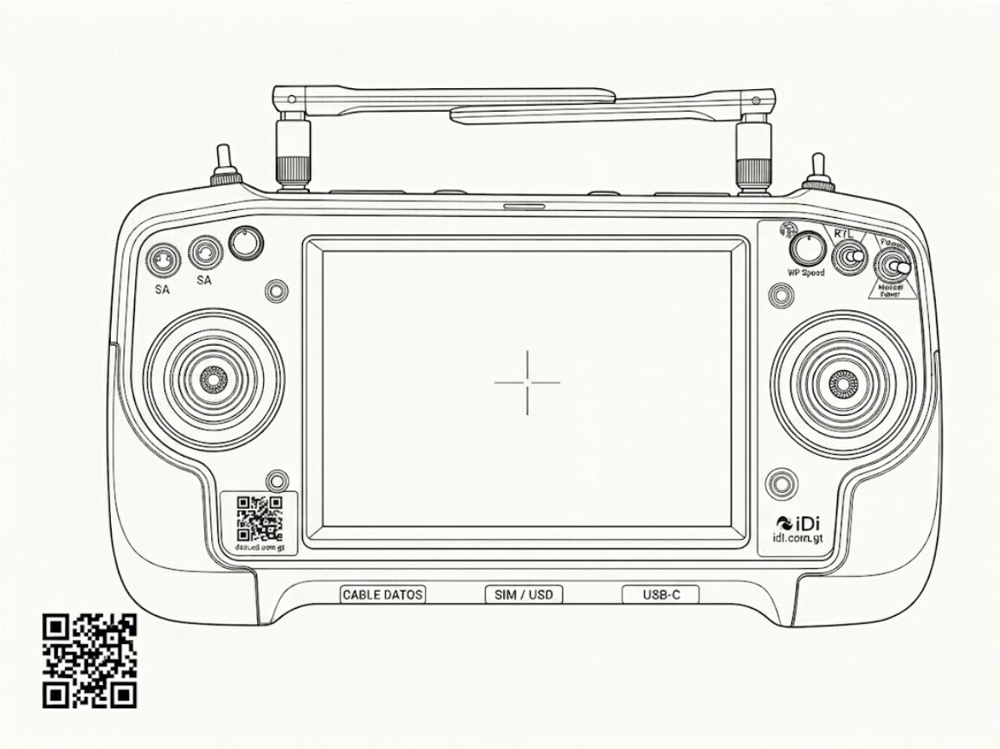
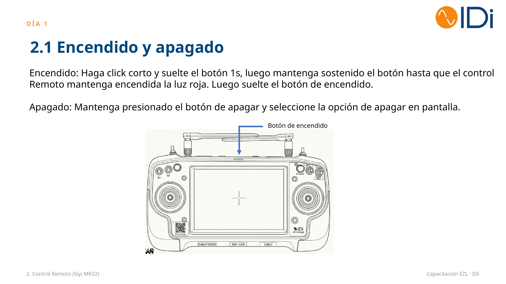
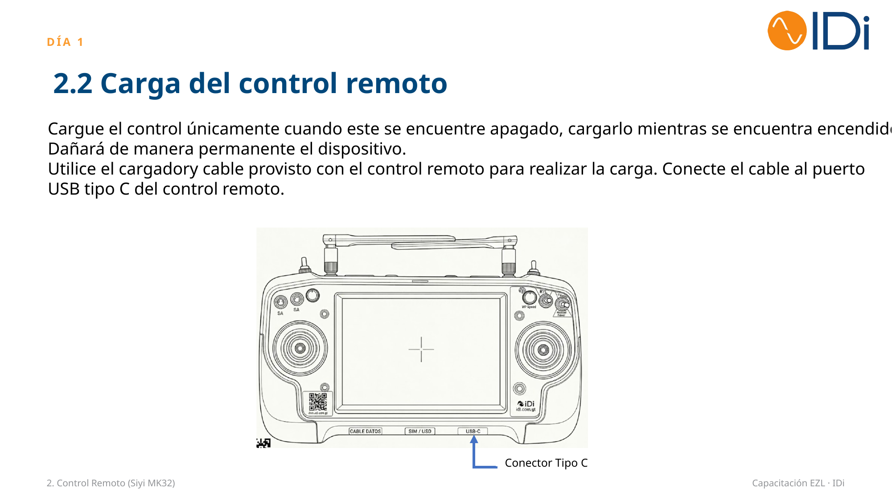
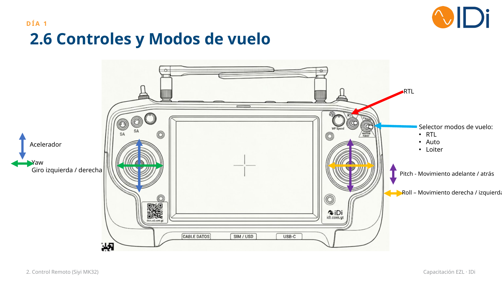
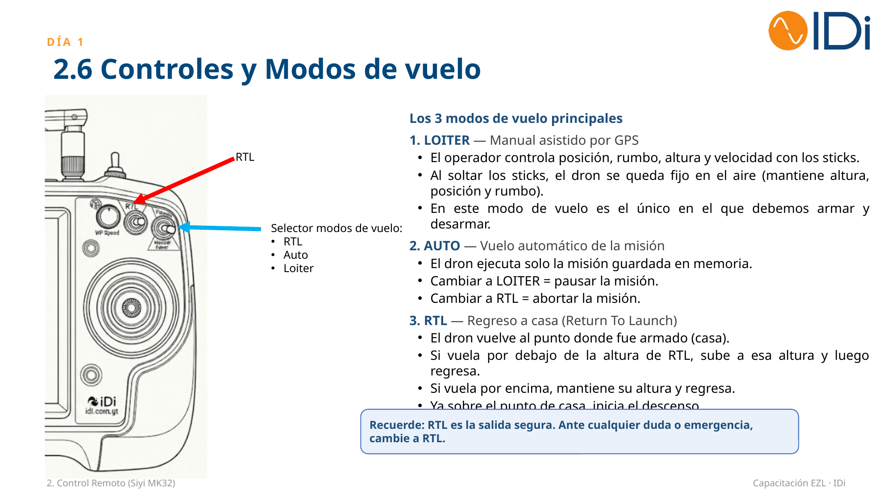
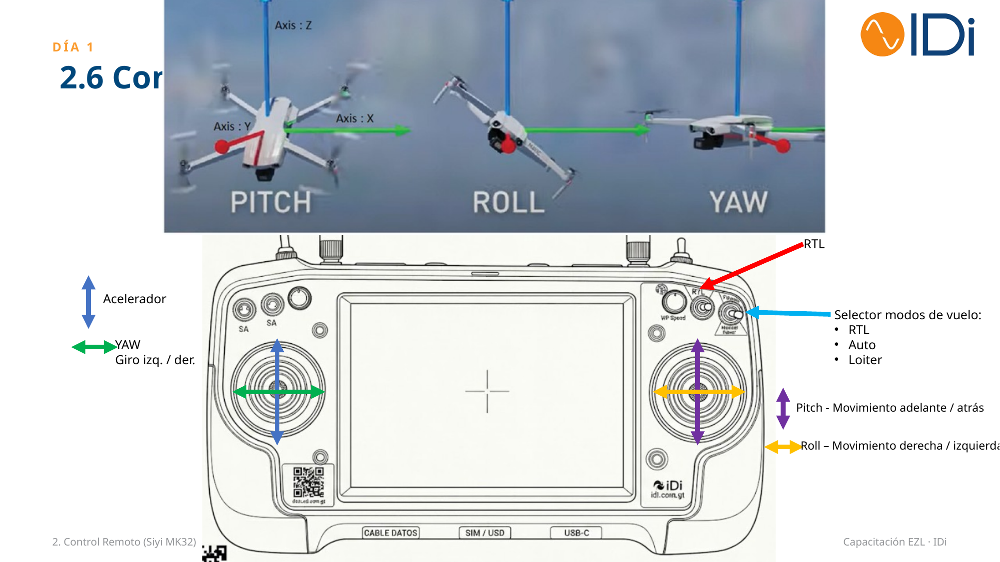

# 🎮 Control Remoto (SIYI MK32)

El EZL se opera con el control remoto **SIYI MK32**. Esta sección cubre su encendido, carga, controles físicos y los modos de vuelo disponibles.

## 🔘 2.1 Encendido y apagado

- **Encendido:** haga clic corto y suelte el botón 1s, luego mantenga sostenido el botón hasta que el control remoto mantenga encendida la luz roja. Luego suelte el botón de encendido.
- **Apagado:** mantenga presionado el botón de apagar y seleccione la opción de apagar en pantalla.

## 🔋 2.2 Carga del control remoto

Utilice el cargador y cable provistos con el control remoto para realizar la carga. Conecte el cable al puerto USB tipo C del control remoto.

:::danger[Cargar solo apagado]

Cargue el control únicamente cuando este se encuentre apagado. Cargarlo mientras está encendido dañará de manera permanente el dispositivo.

:::

## 💻 2.3 Modo de uso SIYI TX / 2.4 Transferencia de misiones vía USB

:::info[Contenido en preparación]

El material de capacitación original marca esta sección como pendiente de completar (enlace a IDi Docs y video por publicar).

:::

## 🛩️ 2.5 Física del dron

  <iframe
    style={{position: 'absolute', top: 0, left: 0, width: '100%', height: '100%'}}
    src="https://www.youtube.com/embed/tNuISxCC4Y0"
    title="Física del dron"
    frameBorder="0"
    allow="accelerometer; autoplay; clipboard-write; encrypted-media; gyroscope; picture-in-picture; web-share"
    allowFullScreen>
  </iframe>

## 🕹️ 2.6 Controles y modos de vuelo

- **Acelerador:** movimiento vertical del stick izquierdo.
- **Yaw:** movimiento horizontal del stick izquierdo — giro izquierda / derecha.
- **Pitch:** movimiento vertical del stick derecho — adelante / atrás.
- **Roll:** movimiento horizontal del stick derecho — derecha / izquierda.
- **Selector de modos de vuelo:** RTL, Auto, Loiter.

### Los 3 modos de vuelo principales

**1. LOITER — Manual asistido por GPS**
- El operador controla posición, rumbo, altura y velocidad con los sticks.
- Al soltar los sticks, el dron se queda fijo en el aire (mantiene altura, posición y rumbo).
- En este modo de vuelo es el único en el que debemos armar y desarmar.

**2. AUTO — Vuelo automático de la misión**
- El dron ejecuta solo la misión guardada en memoria.
- Cambiar a LOITER = pausar la misión.
- Cambiar a RTL = abortar la misión.

**3. RTL — Regreso a casa (Return To Launch)**
- El dron vuelve al punto donde fue armado (casa).
- Si vuela por debajo de la altura de RTL, sube a esa altura y luego regresa.
- Si vuela por encima, mantiene su altura y regresa.
- Ya sobre el punto de casa, inicia el descenso.

:::tip[Recuerde]

RTL es la salida segura. Ante cualquier duda o emergencia, cambie a RTL.

:::

