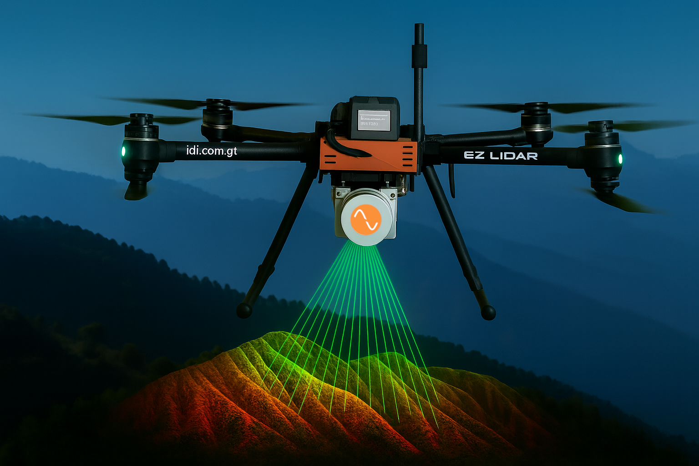

# EZ LiDAR (EZL)

Diseñado  y  ensamblado  en  Guatemala, EZ  LIDAR  redefine  la  exploración  aérea  con  su avanzada  tecnología  y  diseño robusto. En  su  configuración  X8,  el  EZ  LIDAR  brinda  la robustez y fiabilidad de un octocóptero en una forma más compacta y fácil de operar. 

## Especificaciones Técnicas

### 🚁 General

| Característica       | Especificación         |
|------------------------|--------------------------|
| Diámetro                | 900mm                    |
| Hélice                  | 20.2"                      |
| # de Rotores            | 8                         |
| Propulsión              | Eléctrica                |
| Autonomía de vuelo      | 25 minutos máximo con payload de 2.2kg    |
| Velocidad de crucero    | 18 km/h                   |
| Modos de vuelo          | Manual / Automático       |
| Capacidad de carga      | 2.2 kg                    |
| Peso total (AUW)		| 8.2 kg 					|

### 🌐 Cobertura y alcance

| Característica          | Especificación   |
|----------------------------|-------------------|
| Cobertura para mapeo        | 25-50 Ha*            |
| Distancia lineal / vuelo    | 8 km              |
| Altura máxima                | 350m AGL          |
| Altitud                       | 5000m ASL         |

### 📡 Comunicación

| Característica            | Especificación        |
|------------------------------|-------------------------|
| Rango de comunicación         | 5Km LOS                |
| Frecuencia de operación       | 900 MHz / 2.4GHz         |

### 📍 Posicionamiento

| Característica  | Especificación                 |
|--------------------|-----------------------------------|
| Georeceptor          | GPS, Glonas, Beidou + RTK          |
| Precisión             | ± 3 cm en modo RTK                |

### 🔋 Batería

| Característica         | Especificación |
|----------------------------|-------------------|
| Tipo Batería                 | LiPo               |
| Batería                       | 22V 17AH           |

### 📷 Sensor

| Característica    | Especificación                                             |
|-----------------------|-----------------------------------------------------------------|
| Sensor Principal        | Sujeto a requerimiento                                                |

*Nota: sujeto a sensor a utilizar y requerimientos de la misión.