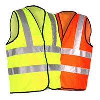
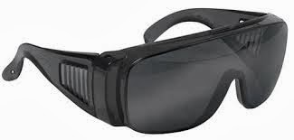
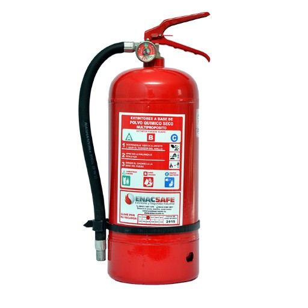
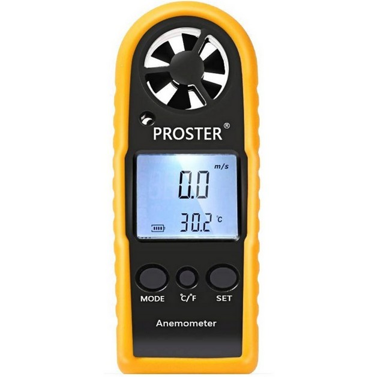
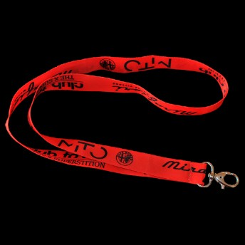

# ⚠️ Precauciones durante el uso del equipo

Cuidados y precauciones en la operación del EZL.

## ✈️ Inspección previa al vuelo

Antes de cada operación se debe verificar que:

- El drone y el sensor LiDAR no presenten daños físicos, grietas o deformaciones.
- El sensor LiDAR esté correctamente instalado y asegurado al sistema de montaje.
- Las hélices estén limpias, sin fisuras, deformaciones o desgaste excesivo.
- Las baterías del drone y del control remoto estén completamente cargadas y en buen estado.
- Los conectores eléctricos estén limpios y correctamente acoplados.
- El lente del sensor LiDAR esté limpio y libre de polvo, agua o manchas.
- Las tarjetas de memoria cuenten con espacio suficiente para almacenar los datos del levantamiento.
- El firmware del drone, del sensor LiDAR y del controlador remoto se encuentre actualizado y sea compatible entre sí.

## 🗺️ Verificación del área de operación

Antes del despegue se recomienda:

- Confirmar que el área esté libre de personas no autorizadas.
- Identificar obstáculos como árboles, postes, edificios, líneas eléctricas, antenas o torres.
- Verificar que no existan interferencias electromagnéticas significativas.
- Confirmar que el vuelo esté permitido conforme a la normativa aeronáutica vigente.
- Definir un área segura para despegue y aterrizaje.
- Establecer rutas de evacuación y procedimientos de emergencia.

## 🛫 Despegues y aterrizajes

- Despeje la zona de despegue, verifique que esté libre de personas, animales y objetos.
- Asegúrese de seguir todos los puntos del checklist.
- Arme el multirotor únicamente cuando esté listo para el despegue.
- Guarde una distancia mínima de 3 m desde el punto en que el multirotor despegará.
- Utilice lentes oscuros que le permitan la visibilidad al cielo.
- Al aterrizar, asegurarse nuevamente de que no exista ninguna persona, animal u objeto en la zona.
- Mantenga a la mano un extintor de incendios.

## 🦺 Uso de equipo de seguridad

  

**Chaleco**

  

  

**Lentes de protección**

  

  

**Extintor**

  

  

**Anemómetro**

  

  

**Cinta para control**

  

  

**Botiquín**

  

## 🌦️ Condiciones meteorológicas

:::caution[No se recomienda operar cuando existan]

- Lluvia o llovizna.
- Tormentas eléctricas.
- Niebla densa.
- Granizo.
- Vientos superiores a 10 km/h.
- Baja visibilidad.
- Condiciones que puedan afectar la recepción GNSS.
- Vuelos nocturnos.

Las operaciones deben suspenderse inmediatamente cuando las condiciones climáticas comprometan la seguridad del vuelo.

:::

## 🛰️ Seguridad operacional durante el vuelo

El operador deberá:

- Mantener contacto visual con la aeronave siempre que sea posible.
- No exceder la altura máxima autorizada (120 m AGL).
- Respetar las distancias mínimas respecto a personas y edificaciones.
- Evitar maniobras bruscas que afecten la estabilidad del sensor.
- Supervisar continuamente el nivel de batería.
- Monitorear la intensidad de la señal GNSS y del enlace de comunicación.
- Estar preparado para ejecutar un aterrizaje seguro en caso de emergencia.
- Monitorear el tráfico aéreo en la ventana Fly de QGC, Flight Radar y señal UHF de radio.

## 🔋 Monitoreo de baterías

Durante la operación:

- Vigilar continuamente el porcentaje de carga.
- Programar el retorno antes de alcanzar el nivel crítico (30%).
- No continuar el vuelo cuando el sistema emita advertencias de batería baja.

## 🏁 Finalización del vuelo

Después del aterrizaje se debe:

- Detener correctamente el registro del sensor LiDAR.
- Apagar el drone siguiendo la secuencia recomendada en la guía de usuario.
- Retirar las baterías si el equipo no será utilizado nuevamente en el corto plazo.
- Inspeccionar el sensor para verificar que no existan daños ocasionados durante el vuelo.
- Respaldar inmediatamente la información obtenida.
- Registrar el vuelo en bitácora física e IDi Drone Ops, haciendo mención de cualquier eventualidad, mensaje, alerta o incidente importante a resaltar.

## 🛑 Situaciones en las que debe suspenderse inmediatamente el vuelo

:::danger[La operación deberá interrumpirse cuando se presente cualquiera de las siguientes condiciones]

- Pérdida de señal GNSS.
- Pérdida de comunicación entre el drone y el control remoto.
- Advertencias del sistema IMU o brújula.
- Sobrecalentamiento del sensor LiDAR.
- Batería en nivel crítico.
- Lluvia o condiciones meteorológicas adversas.
- Vientos superiores a 10 km/h.
- Presencia inesperada de aeronaves tripuladas en el área de operación.
- Comportamiento anormal del drone o del sistema de navegación.

:::

## 🚨 En caso de accidentes / emergencias

:::danger[Procedimiento ante colisión]

1. Luego de la colisión, cambie inmediatamente a modo de vuelo manual y suprima el acelerador completamente.
2. Proceda a desarmar el equipo en Control Remoto o QGC.
3. Desconecte la batería LiPo utilizada (almacenarlas por separado).
4. Haga una inspección de los daños y anótelo en la bitácora de vuelo.
5. Contacte a su seguro de responsabilidad civil.

:::
