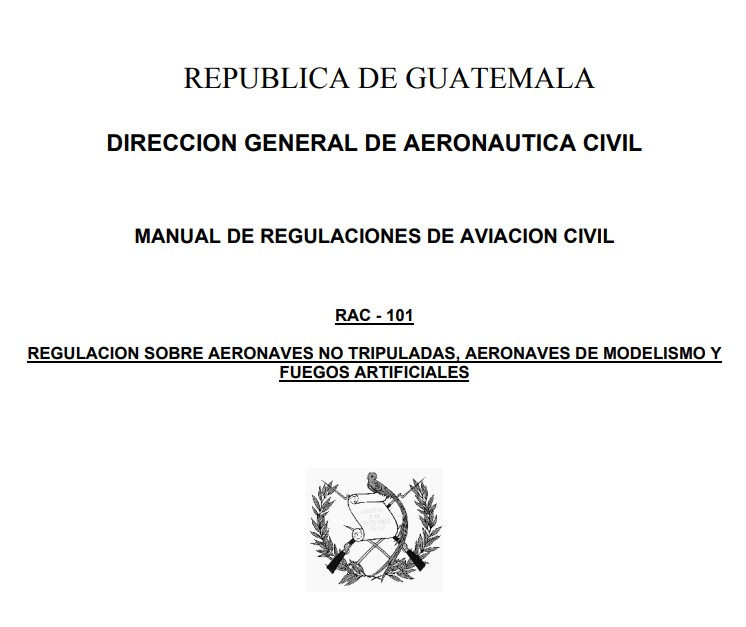
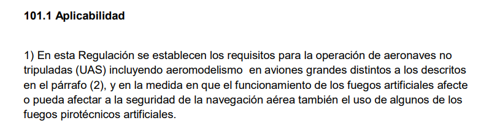
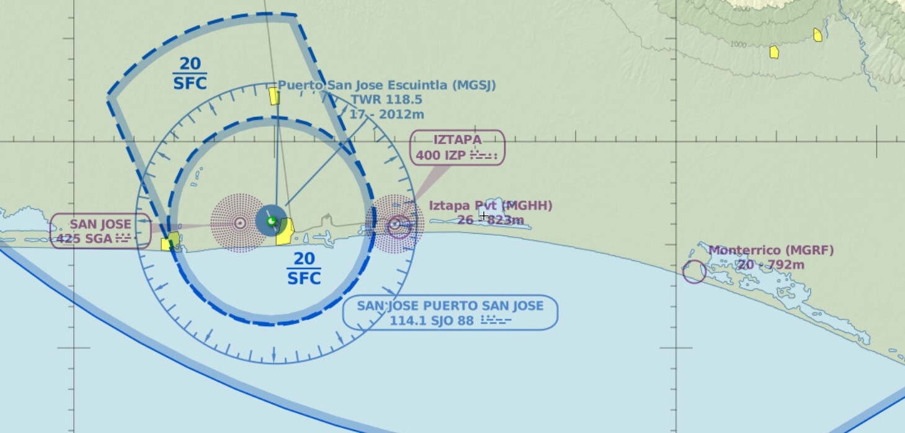
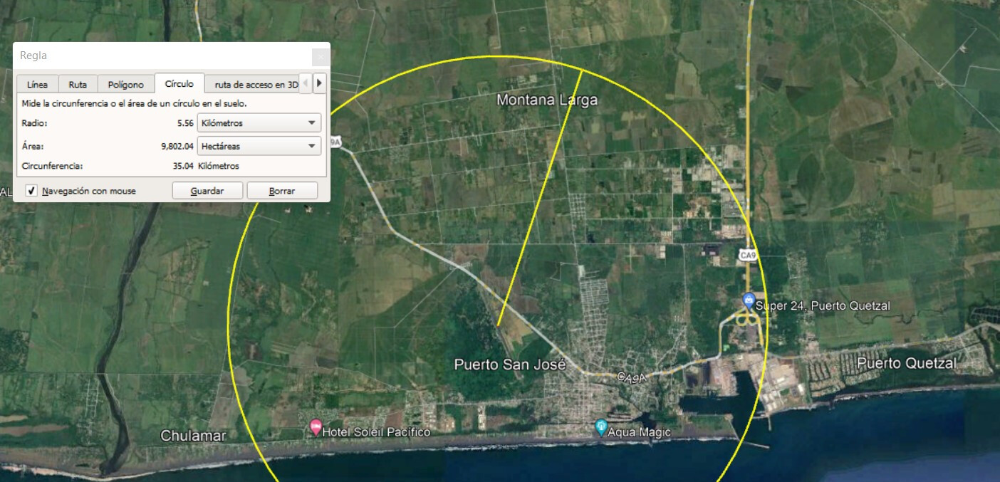

# 🛂 Regulación Nacional

Marco normativo aplicable a la operación de drones en Guatemala.

## 📜 RAC-101 — Aeronaves no tripuladas

La **Dirección General de Aeronáutica Civil (DGAC)** de Guatemala regula la operación de drones a través del **RAC-101**, dentro del Manual de Regulaciones de Aviación Civil: *"Regulación sobre aeronaves no tripuladas, aeronaves de modelismo y fuegos artificiales"*.

### 101.1 Aplicabilidad

En esta Regulación se establecen los requisitos para la operación de aeronaves no tripuladas (UAS), incluyendo aeromodelismo en aviones grandes distintos a los descritos en el párrafo (2), y en la medida en que el funcionamiento de los fuegos artificiales afecte o pueda afectar a la seguridad de la navegación aérea, también el uso de algunos de los fuegos pirotécnicos artificiales.

:::info[Rango de aplicación]

Drones con peso de despegue total mayor a 100 gramos y menor a 100 kilogramos.

:::

### 101.13 Operaciones peligrosas prohibidas

- Una persona no debe operar una aeronave no tripulada de una manera que produzca un peligro a otra aeronave, otra persona o propiedad.
- **101.17 Operación cerca de otra aeronave:** ninguna persona puede operar una aeronave lo suficientemente cerca de otra aeronave de modo que pueda crear un peligro de colisión.
- **101.21 Operación en zona prohibida o restringida.**
- **101.23 Operación en espacio aéreo controlado.**
- **101.25 Operación cerca de los aeródromos:** una persona no debe operar una aeronave no tripulada por encima de 400 pies AGL dentro de 3 millas náuticas de un aeródromo, a menos que:
  - a) La operación de la aeronave esté respaldada por un Certificado Operativo (CO), o
  - b) Se haya emitido un permiso especial para una operación específica.

## 🚫 Zonas prohibidas

:::danger[No operar drones sobre]

- El Palacio Nacional.
- Casa Presidencial.
- Bases o Instalaciones Militares.
- Embajadas.
- Zonas Primarias dentro de los puertos marítimos y terrestres.
- Perímetros de aproximación y despegue de aeronaves en aeropuertos y aeródromos.

:::

## 🗺️ Mapa de espacio aéreo

*Fuente: [www.skyvector.com](https://www.skyvector.com)*

## 🛬 Operación cerca de aeródromos

## ℹ️ Información adicional

:::note[Consulte siempre la fuente oficial]

Los requisitos de registro, tarifas, formularios y permisos pueden actualizarse. Antes de operar, confirme la normativa vigente directamente con la DGAC:

- 🌐 Portal de drones DGAC: [dgac.gob.gt/dvso/drones](https://www.dgac.gob.gt/dvso/drones/)
- 📄 Texto oficial RAC-101: [dgac.gob.gt](https://www.dgac.gob.gt/wp-content/uploads/2022/07/RAC-101-Revision-Original.pdf)
- ✉️ Contacto para solicitudes y dictamen técnico: dvso@dgac.gob.gt

:::
