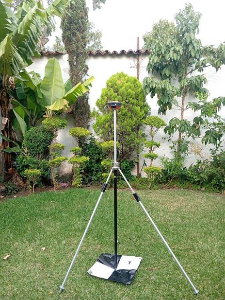
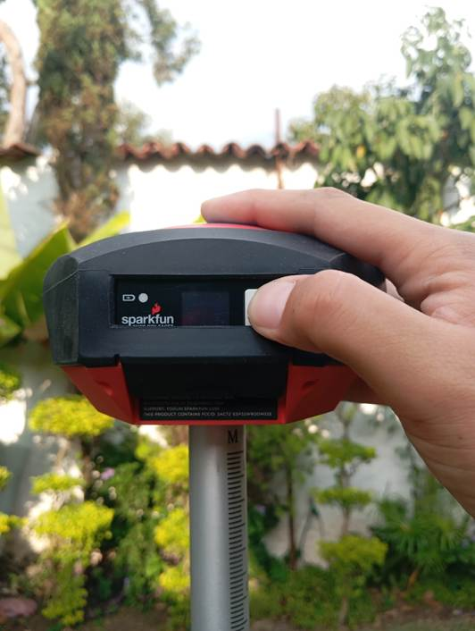
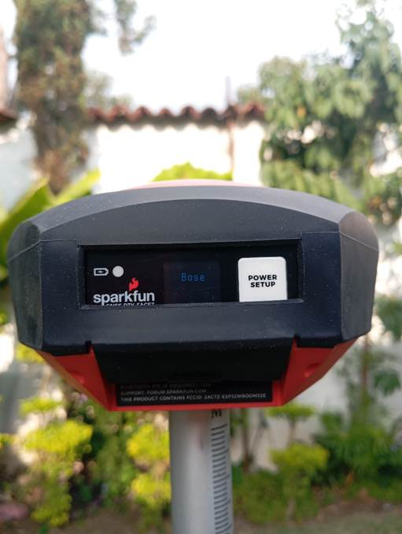
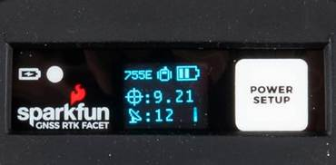
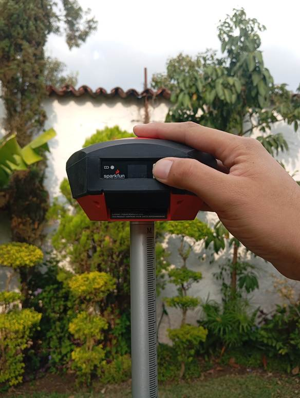

# 📡 Guía de Posicionamiento Base GNSS LiDAR

Esta guía describe el procedimiento para posicionar, encender y grabar datos con la base **GNSS SparkFun RTK Facet**, previo al vuelo del **dron EZL** equipado con sensor LiDAR.

:::tip[Antes de empezar]

Antes de proceder con el montaje del dron EZL, se recomienda utilizar un **bastón o trípode** situado sobre nuestra base de referencia. Si realizaremos operaciones en una misma área de manera recurrente, se recomienda ubicarlo sobre un **mojón o punto de control fijo**.

:::

:::caution[Tiempos de grabación]

Una vez posicionado el instrumento, iniciamos la grabación de datos crudos GNSS como **mínimo 10 minutos antes** de encender el sensor LiDAR y **5 minutos después** de haberlo apagado.

:::



---

## 1️⃣ Encendido del equipo

Para encender, mantenemos presionado el **botón blanco** hasta que se encienda la pantalla.



---

## 2️⃣ Verificar el modo BASE

Nos aseguramos que esté en modo **"BASE"** — automáticamente empieza a grabar datos crudos.



---

## 3️⃣ Confirmar la grabación

Debe aparecer una pantalla similar a la siguiente, la cual nos indica que el GNSS ya está grabando (número de satélites, precisión y estado de batería).



---

## 4️⃣ Al finalizar la misión

Al finalizar la misión con el dron EZL:

1. Apagamos la base.
2. Retiramos la memoria.
3. Copiamos la información generada durante el vuelo.

Los archivos creados llevan por nombre la **fecha y hora GPS** del inicio de grabación, siguiendo el siguiente formato:

```
SFE_Facet_AAMMDD_HHMMSS.ubx
```



Para apagar, presionamos el **botón blanco** nuevamente y lo mantenemos presionado hasta que se apague la pantalla. ✅

---

## 📋 Resumen rápido

| Paso | Acción | Tiempo clave |
|------|--------|--------------|
| 1 | Montar la base sobre trípode/bastón en el punto de referencia | — |
| 2 | Encender (botón blanco) y confirmar modo **BASE** | Inicia grabación automática |
| 3 | Esperar antes de encender el LiDAR | ⏱️ Mínimo 10 min antes |
| 4 | Volar la misión con el dron EZL | — |
| 5 | Esperar después de apagar el LiDAR | ⏱️ Mínimo 5 min después |
| 6 | Apagar la base y respaldar el archivo `.ubx` | — |
