# 📡 Configuración base SparkPNT para corrección RTK mediante QGC

Esta guía describe el procedimiento para configurar el receptor **GNSS SparkPNT FPX** como base RTK y transmitir las correcciones al dron mediante **NTRIP** usando **IDI‑QGroundControl (QGC)**.

:::tip[Antes de empezar]

Obtenga las coordenadas del punto que utilizará como base y conviértalas a **WGS84 en grados decimales**.

En este ejemplo se trabaja con:

| Coordenada | Valor |
|---|---|
| Latitud | `15.304445015` |
| Longitud | `-86.778318416` |
| Altura (Z) | `325.052` |

:::

---

## 1️⃣ Encendido y modo CONFIG

Encienda el GNSS manteniendo presionado el **botón de encendido**.

Presione el botón **FN** hasta marcar el modo **CONFIG** y selecciónelo presionando el botón de apagado.

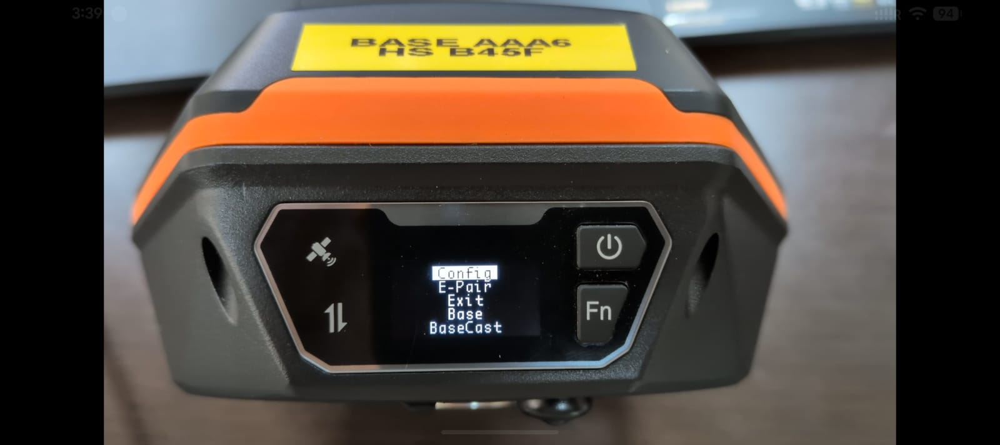

---

## 2️⃣ Conexión a la red WiFi de configuración

Una vez seleccionado el modo CONFIG, el SparkPNT crea una red WiFi abierta — en este ejemplo `RTK Config AAA606`. Conéctese a ella usando un teléfono o PC.

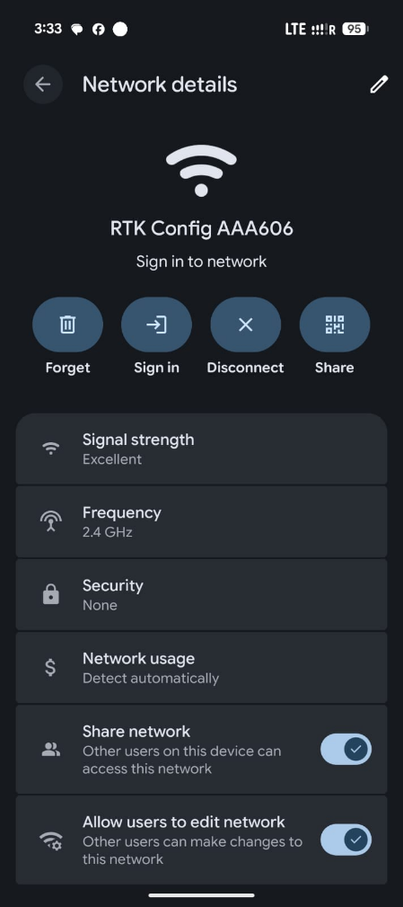

:::caution[Datos móviles]

Una vez conectado a la red WiFi, **apague los datos móviles** si se conectó mediante teléfono, para evitar que el navegador use la conexión celular en lugar de la del equipo.

:::

Ingrese la siguiente dirección IP en su navegador:

```
192.168.4.1
```

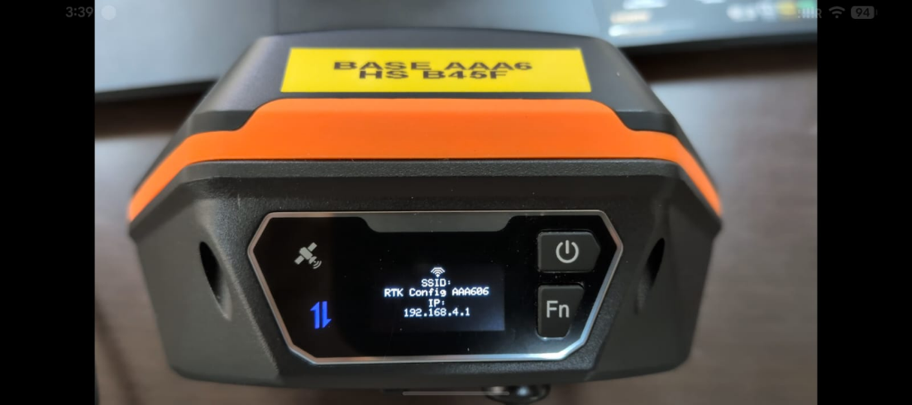

---

## 3️⃣ Panel de configuración web

En el navegador se desplegará el siguiente menú. Seleccione **Base Configuration**.

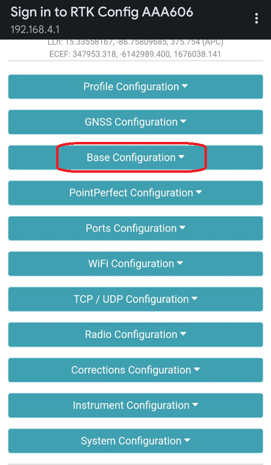

---

## 4️⃣ Configuración de la base (Base Configuration)

Dentro de las opciones de **Base Configuration**, marque:

- **Fixed**, ya que ingresará coordenadas conocidas de la base.
- **Geodetic**, para ingresar coordenadas de latitud, longitud (grados decimales WGS84) y altitud (metros) del punto que utilizará como base.
- **Calculate HAE APC**, para indicarle al GNSS que la altura de referencia es a nivel de suelo (altura conocida).

En caso de que la coordenada de la base se utilizará de manera recurrente, ingrese un nombre en el campo **Name** y de clic en **Add** para agregarla a la lista de coordenadas conocidas.

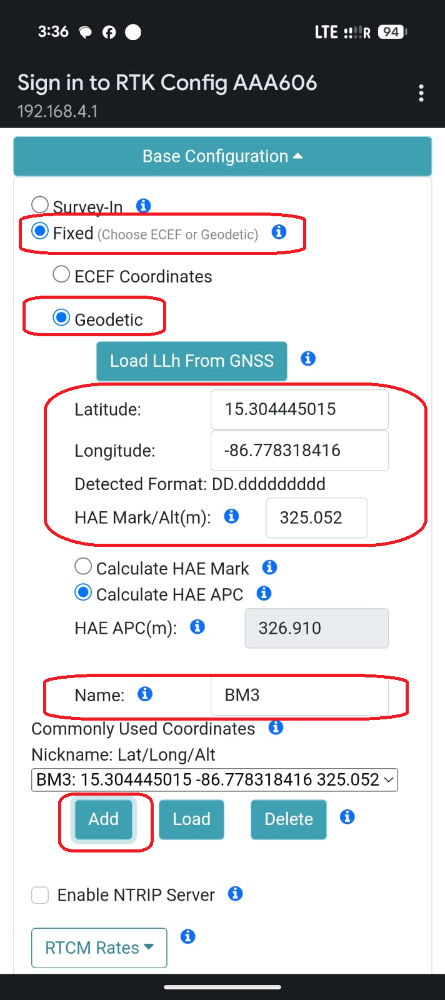

---

## 5️⃣ Configuración del sistema (System Configuration)

Seleccione el menú **System Configuration** y en el apartado **System Initial State**, seleccione **BaseCast**.

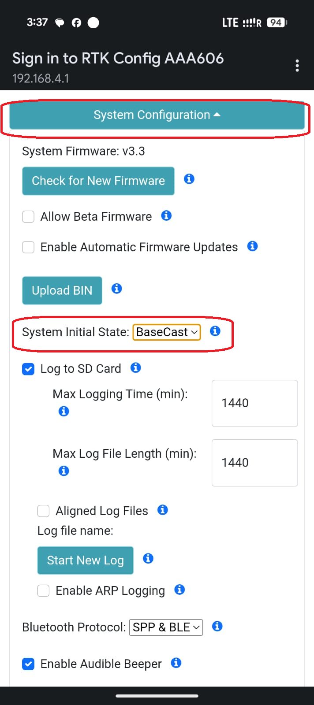

---

## 6️⃣ Guardar y reiniciar

Luego de realizar los cambios, de clic en **Save Configuration** y posteriormente en **Exit and Reset**.

Luego de esto el SparkPNT se reiniciará y comenzará a transmitir las correcciones vía NTRIP en un servidor interno, a través de una red WiFi propia.

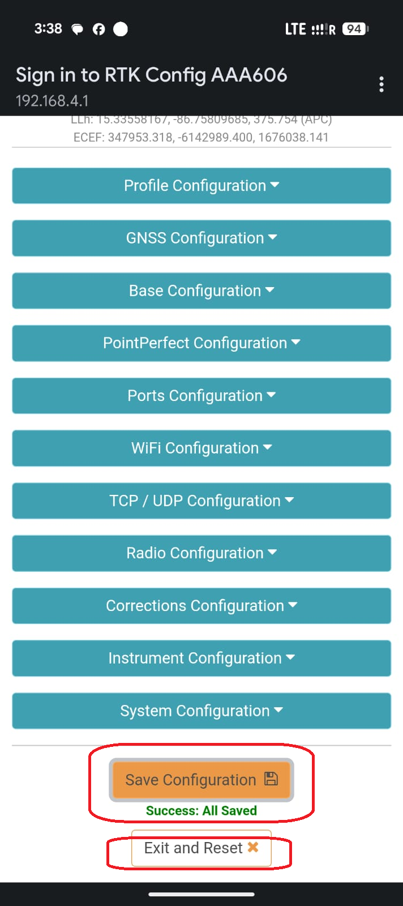

---

## 7️⃣ Conexión a la red de transmisión RTK

Una vez el SparkPNT se ha reiniciado en modo **BaseCast**, diríjase al Control Remoto, Tablet o PC y conéctese a la red WiFi que crea el GNSS — en este ejemplo `RTK AAA606`.

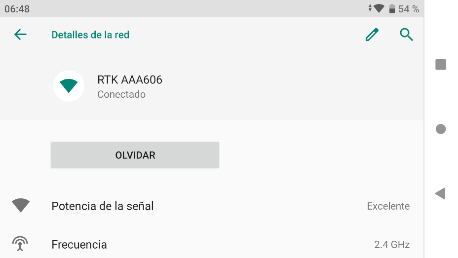

---

## 8️⃣ Configuración NTRIP/RTK en IDI‑QGroundControl

Inicie **IDI – QGroundControl** y seleccione **Settings**.

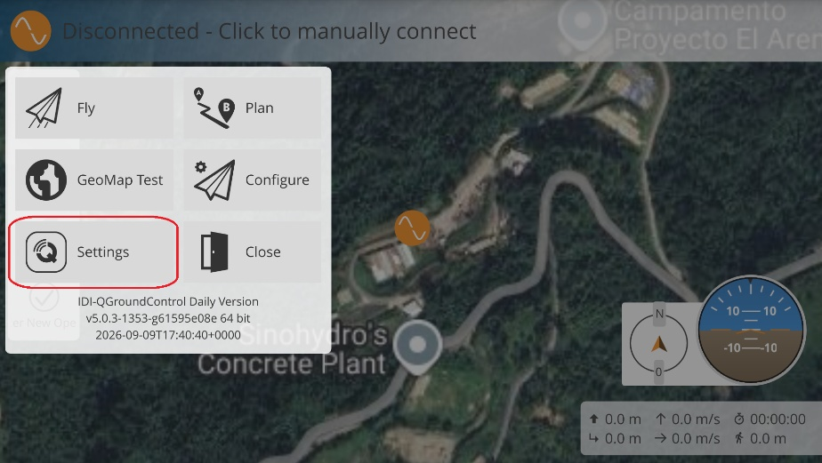

Seleccione **NTRIP/RTK** e ingrese la siguiente configuración:

| Campo | Valor |
|---|---|
| Host Address | `192.168.4.1` |
| Server port | `2101` |
| Username | *(dejar en blanco)* |
| Password | *(dejar en blanco)* |
| Mount Point | `SparkBase` |

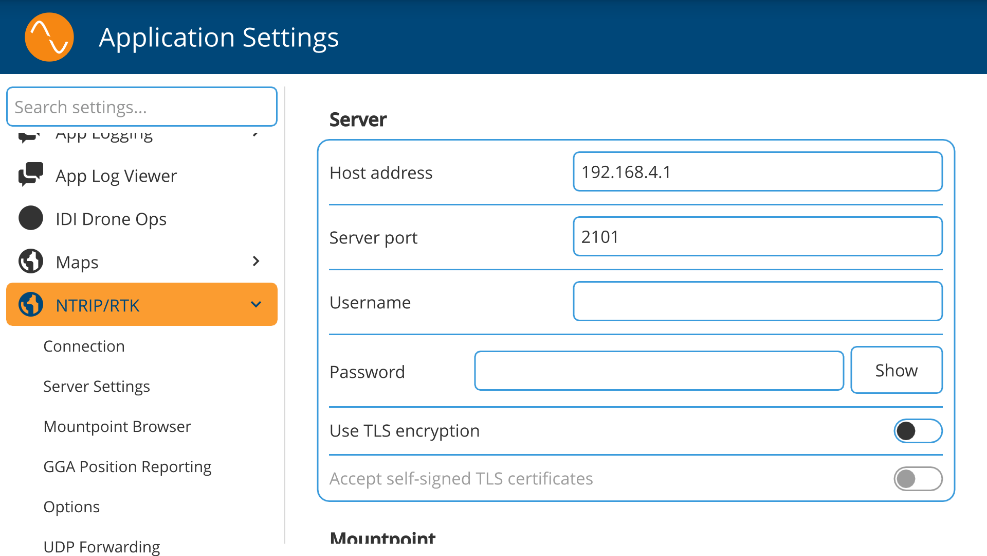

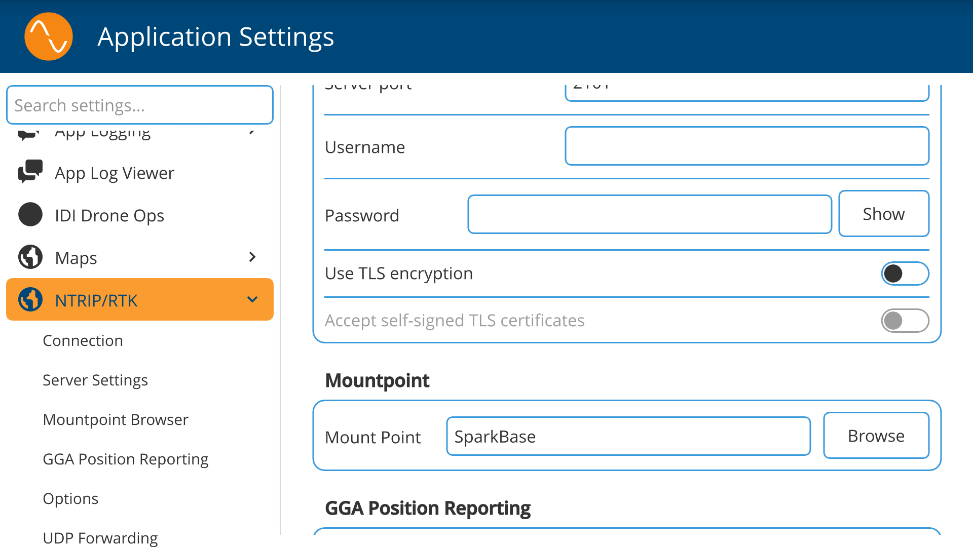

Luego haga clic en **Connect**.

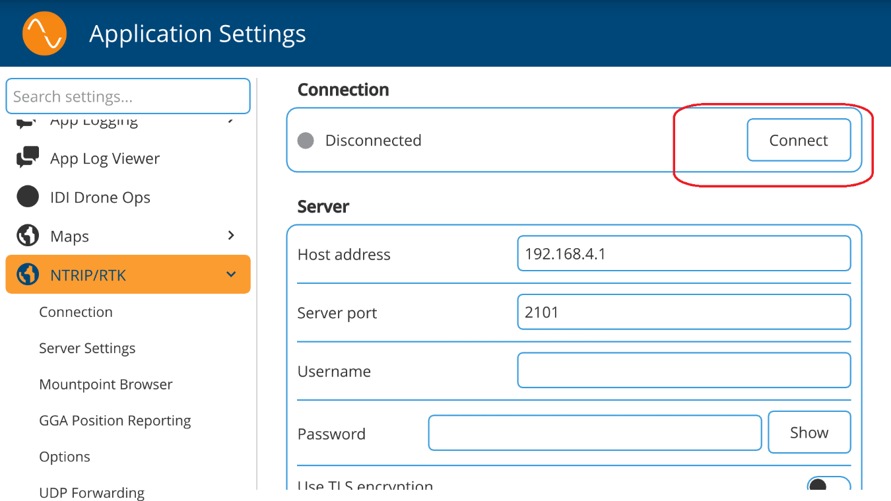

---

## ✅ Verificación de la conexión

De esta forma ya está recibiendo correcciones mediante su receptor SparkPNT y enviándolas al dron para realizar correcciones RTK.

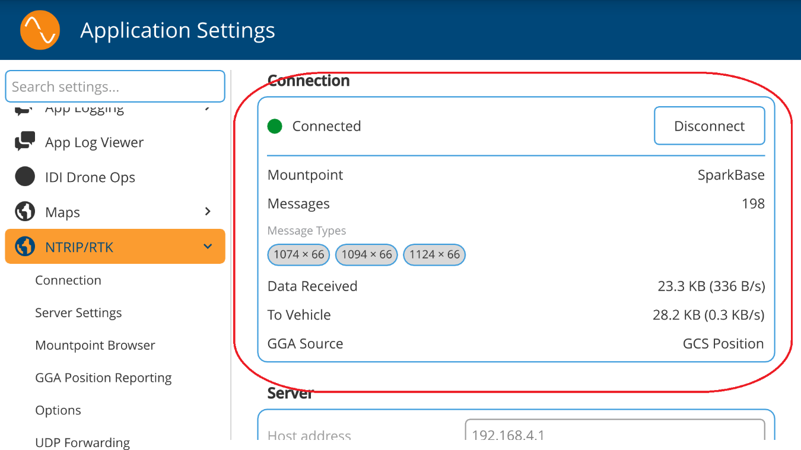

---

## 📋 Resumen rápido

| Paso | Acción |
|------|--------|
| 1 | Encender el SparkPNT y entrar al modo **CONFIG** |
| 2 | Conectarse a la red WiFi `RTK Config AAA606` e ingresar a `192.168.4.1` |
| 3 | Entrar a **Base Configuration** |
| 4 | Marcar **Fixed** + **Geodetic**, ingresar coordenadas y **Calculate HAE APC** |
| 5 | En **System Configuration**, fijar **System Initial State** en **BaseCast** |
| 6 | **Save Configuration** → **Exit and Reset** |
| 7 | Conectarse a la nueva red WiFi de transmisión (`RTK AAA606`) |
| 8 | En IDI‑QGC, configurar **NTRIP/RTK** con host `192.168.4.1`, puerto `2101` y Mount Point `SparkBase` |
| 9 | Dar clic en **Connect** y verificar la recepción de correcciones RTK |
