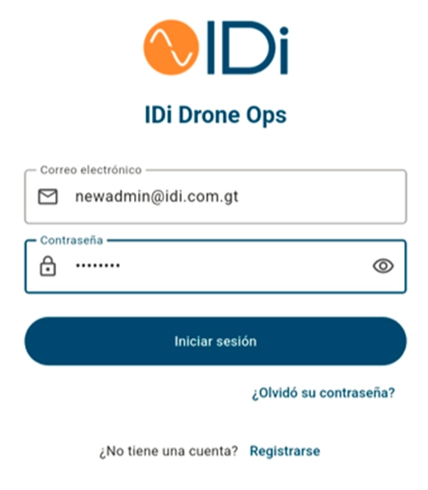
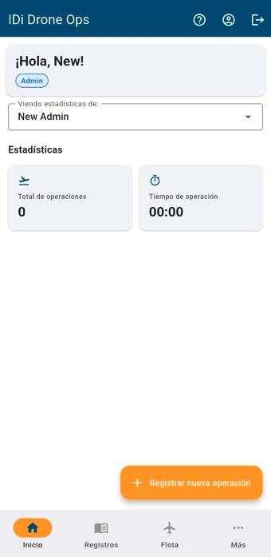

### 1. Registro de Usuario

- Ingresa correo electronico y contraseña e inicia sesion.

### 2. Exploración de Funciones

- Familiarízate con las opciones disponibles en el menú principal.

### 3. Crear Nueva Operación

- En la pantalla de inicio, selecciona **“Registrar nueva operación”**.

### 4. Completar Formulario

- Llena todos los campos con la información correspondiente.
- Verifica que los datos sean correctos y completos.

### 5. Lista de Verificación

- Accede a la sección **“Lista de verificación”**.
- Marca cada ítem **solo si todo está en orden**.
    
    
    

### 6. Inspección Final

- Una vez completada la inspección del **HydroSurveyor** y validado el checklist, el botón **“Iniciar operación”** se activará en color rojo.
- Coloca el HydroSurveyor en el punto de salida y selecciona **“Iniciar operación”**.

### 7. Inicio de Misión

- Aparecerá una pantalla con un marcador de tiempo.
- En ese momento, el HydroSurveyor ya deberia de estar ejecutando su misión.

### 8. Fin de Misión

- Al terminar la misión y el HydroSurveyor vuelva al punto de partida detenemos la grabación en “STOP”

- Automaticamente la app nos dara un resumen de operación

- procedemos a guardar el registro de operacion

### 9. Generar y Descargar Reporte

- Seleccionamos el icono de Más.

- Escogemos la opcion Mi reporte de vuelo y seleccionamos “Generar mi reporte”

- Esto generará un reporte que será guardado en tu dispositivo para visualización posterior.
