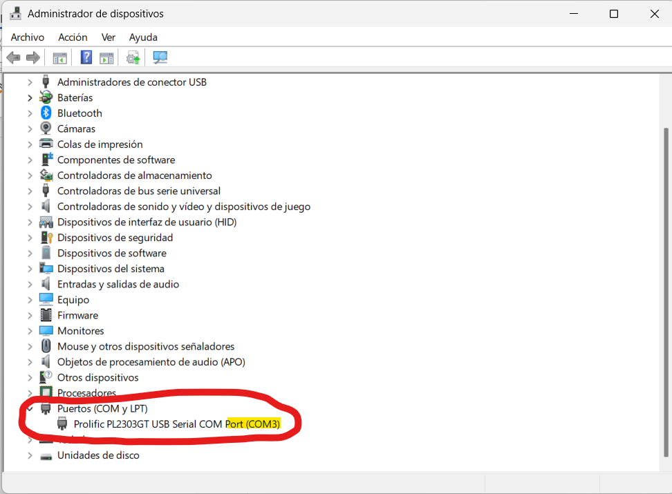
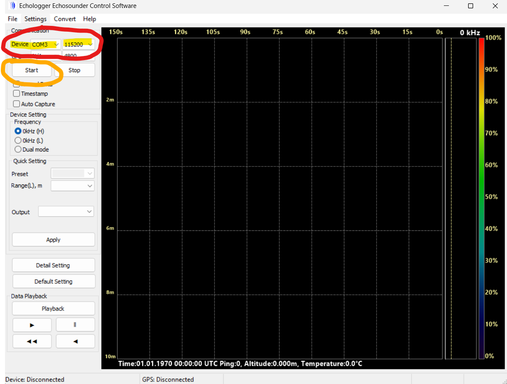
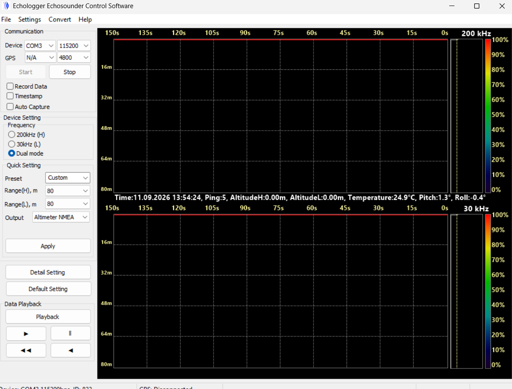
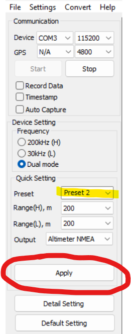
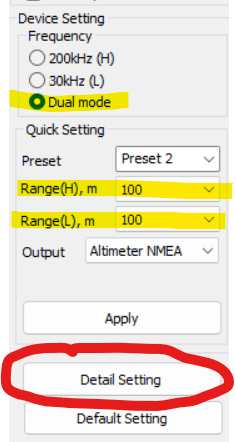
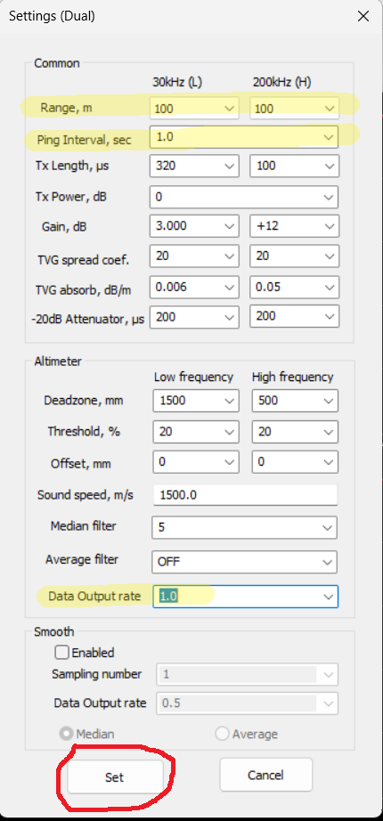

# 🌊 Configuración Ecosonda ECT D032S

Esta guía describe el procedimiento para conectar la ecosonda **EchoLogger ECT D032S** a una PC y configurar sus parámetros mediante el software **Echosounder Control Software**.

---

## 1️⃣ Conexión del hardware

Conecte el cable de la ecosonda a la interfaz Serial‑USB y luego conecte la interfaz al puerto USB de su equipo.

:::tip[Instalación de drivers]

Espere a que se descarguen e instalen los drivers correspondientes de la interfaz. Este paso **requiere conexión a internet**.

:::

---

## 2️⃣ Identificar el puerto COM

En el **Administrador de dispositivos** de Windows, identifique el puerto COM asignado a la interfaz — en este ejemplo, **COM3**.

---

## 3️⃣ Abrir el software de control

Abra el software **Echologger Echosounder Control Software v1.15** proporcionado, seleccione el puerto COM correspondiente a la interfaz y configure la velocidad de conexión en **115200**.

Encienda la ecosonda conectando una de las baterías del dron al cable de alimentación del equipo.

---

## 4️⃣ Iniciar la comunicación

Una vez definidos los parámetros de comunicación y encendida la ecosonda, haga clic en el botón **Start**.

---

## 5️⃣ Verificar los parámetros actuales

A continuación se desplegarán los parámetros que actualmente utiliza la ecosonda.

:::caution[Fuera del agua]

Si la ecosonda se encuentra fuera del agua, es normal que las lecturas de profundidad (Altitude) devuelvan un valor de **0 m**.

:::

---

## 6️⃣ Configurar el preset del dispositivo

En el apartado **Device Setting**, seleccione **Preset 2** y de clic en **Apply**. Esta configuración brinda mejores resultados para aplicaciones generales.

---

## 7️⃣ Seleccionar el modo de trabajo

Seleccione el modo de trabajo **Dual mode** y luego haga clic en **Detail setting**.

---

## 8️⃣ Definir los parámetros de detalle

Defina los parámetros como se muestra a continuación y luego de clic en **Set**.

:::caution[Rango de medición]

El **Range** seleccionado debe ser **mayor a la profundidad del cuerpo de agua** que se va a medir.

:::

Una vez definidos todos los parámetros, de clic en **Set** y espere a que la ecosonda se reinicie.

De esta forma quedan configurados los parámetros de la ecosonda y concluye esta guía. ✅

---

## 📋 Resumen rápido

| Paso | Acción |
|------|--------|
| 1 | Conectar la ecosonda a la interfaz Serial‑USB y ésta al puerto USB |
| 2 | Esperar instalación de drivers (requiere internet) e identificar el puerto COM |
| 3 | Abrir el software, seleccionar el puerto COM y velocidad **115200** |
| 4 | Encender la ecosonda con la batería del dron y dar clic en **Start** |
| 5 | Verificar los parámetros en tiempo real (0 m es normal fuera del agua) |
| 6 | En **Device Setting**, elegir **Preset 2** y dar clic en **Apply** |
| 7 | Seleccionar **Dual mode** y abrir **Detail setting** |
| 8 | Ajustar **Range**, ping interval y demás parámetros, luego dar clic en **Set** |
